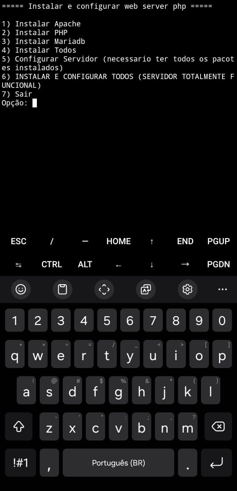
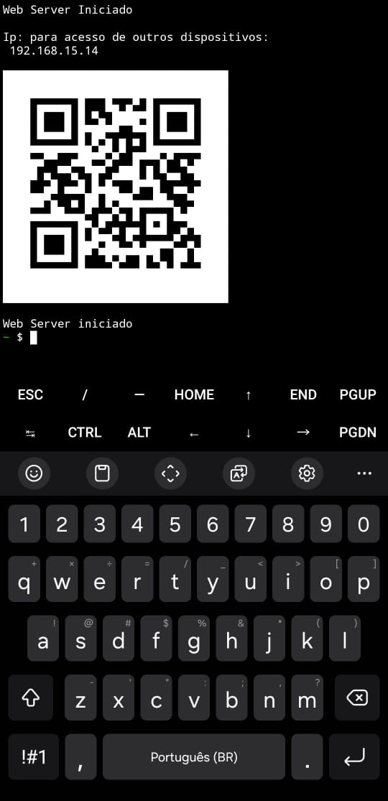
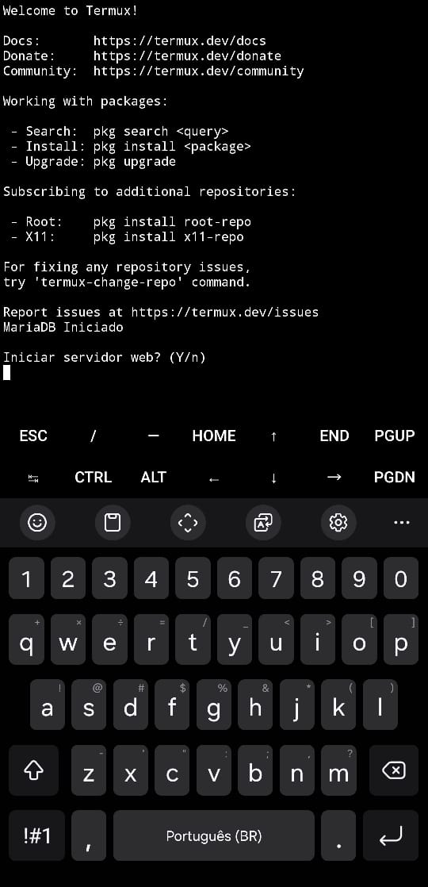

# 🌐 Servidor Web no Termux (Android)

Este projeto permite criar e configurar rapidamente um **servidor web** diretamente no **Android**, usando o **Termux**. Ideal para testes locais, hospedagem leve e estudos.

---

## 📱 Requisitos

- Aplicativo [Termux](https://github.com/termux/termux-app/releases/latest) instalado
- Conexão com a internet (apenas para instalação de pacotes)

---

## ⚙️ Instalação

Abra o Termux e execute os comandos abaixo:

> Recomendo primeiro executar <br>
> `termux-change-repo` <br>
> e escolher um gupo mais proximo de sua localização
> para melhor velocidade de instalação de pacotes

    pkg update -y && pkg upgrade -y && pkg install git -y && git clone https://github.com/GabrielMDeveloper/web-server-termux && cd web-server-termux && chmod +x install.sh && ./install.sh


    
---
## Funções:
- A criação de dois comandos `web-server` e `mariadbctl`para **iniciar,** **parar** ou **reiniciar** os serviços

- Ao iniciar utilizando `web-server start` é gerado um QR code com o endereço IP para facilitar o acesso ao site por outro dispositivo na mesma rede local.



# Especiais:
- O usuário escolhe se deseja iniciar o servidor toda vez que abrir o Termux



- A criação de ~/atalhos-servidor que contem atalhos para as configurações do **Apache** e atalho para a pasta **htdocs**

```
$HOME/
└── atalhos-server/
    ├── apache/
    │   ├── httpd.conf
    │   └── user.conf
    ├── help.txt
    ├── php.ini
    └── htdocs/
```